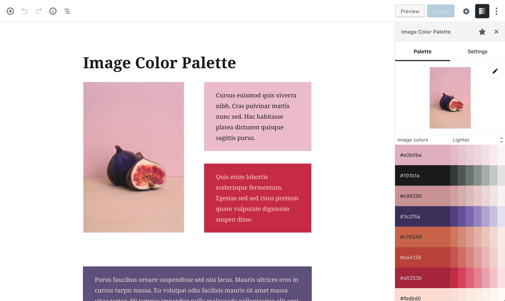
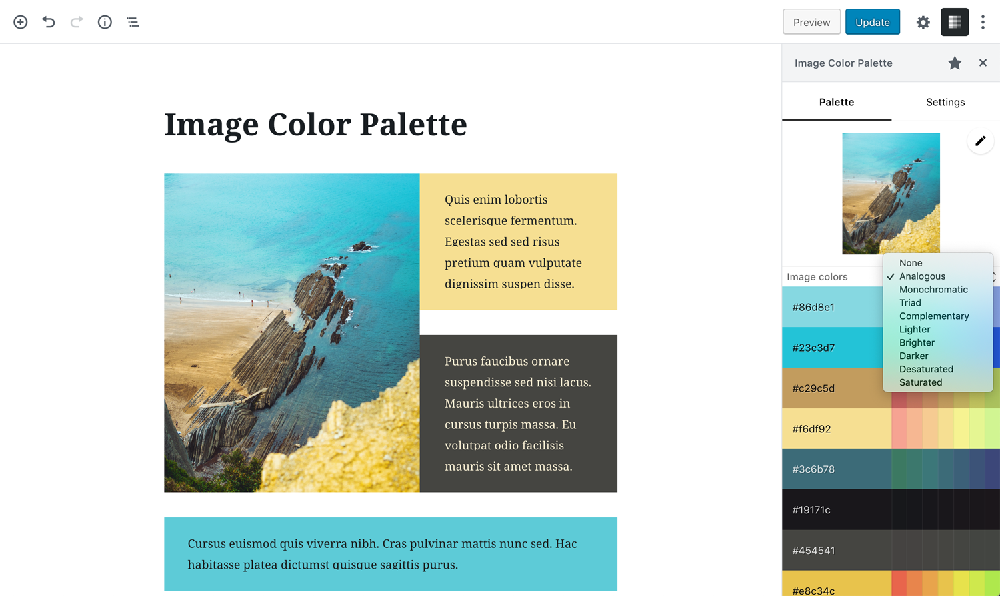

# Image Color Palette

[Demo](https://gutenberg-showcase.melonpan.io/image-color-palette) - [Documentation](https://melonpan.io/wordpress-plugins/image-color-palette) - [WordPress](https://wordpress.org/plugins/image-color-palette)

 

Image Color Palette provides a simple utility to generate a color palette based on the dominant colors of an image. It also creates color schemes based on the image colors.

The colors can be copied to the clipboard and pasted in a color picker. When a registered block is selected the plugin permits applying the color to certain block attributes like text or background color.

 

## Color schemes

Available schemes include:

- Analogous
- Monochromatic
- Triad
- Complementary
- Lighter
- Brighter
- Darker
- Desaturated
- Saturated

 

## Screenshots

