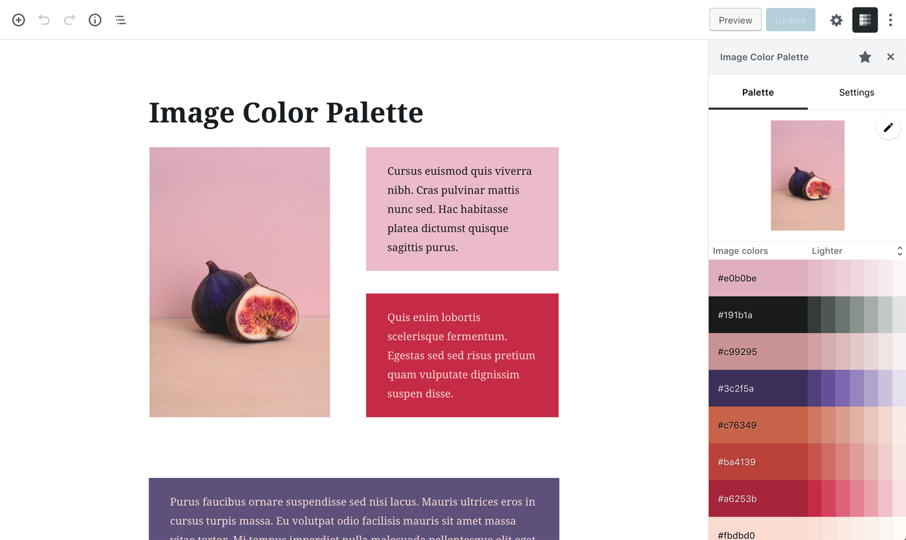
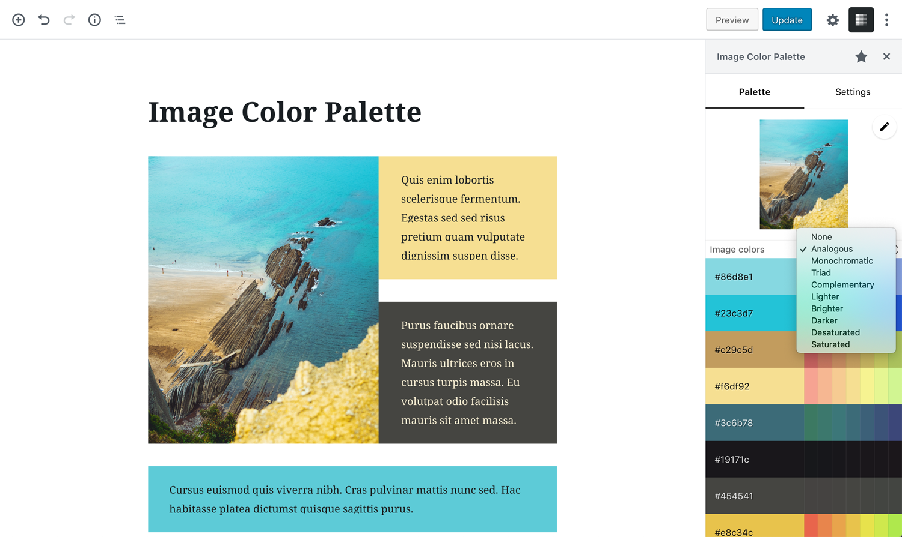

# Image Color Palette

This plugin provides a simple utility to generate a color palette based on the dominant colors of an image.
It also creates color schemes based on the image colors.

The colors can be copied to the clipboard and pasted in a color picker.
When a registered block is selected the plugin permits applying the color to certain block attributes like text or background color.

 

## Color schemes

Available schemes include:

- Analogous
- Monochromatic
- Triad
- Complementary
- Lighter
- Brighter
- Darker
- Desaturated
- Saturated

 

## Usage

Inside the Block editor, the Plugin can be opened from the Show More button (the 3 dots on the right side of the Editor Top Bar).

Click the More button and inside the menu list click on the plugin name **Image Color Palette**.

---

This plugin can be downloaded from the [WordPress repository](https://wordpress.org/plugins/image-color-palette/).
